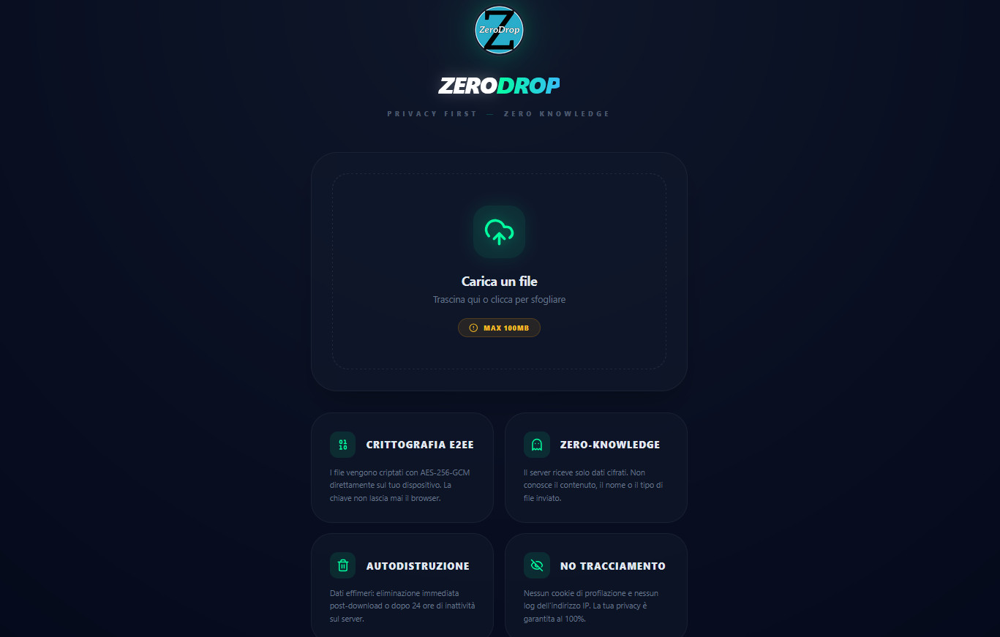

**ZeroDrop** è uno strumento di trasferimento file open-source progettato per garantire la massima privacy e sicurezza. Creato da [TivuStream](https://tivustream.com), segue la filosofia "Privacy First" utilizzando crittografia end-to-end (E2EE) direttamente nel browser dell'utente.

## 🌟 Caratteristiche Principali

-   **Crittografia E2EE (AES-256-GCM)**: I file vengono criptati localmente prima dell'invio. La chiave non lascia mai il dispositivo dell'utente.
-   **Zero-Knowledge**: Il server riceve solo dati cifrati (blob) e non ha alcuna conoscenza del contenuto, del nome o del tipo di file.
-   **Autodistruzione**: I file vengono eliminati dal server immediatamente dopo il primo download o dopo 24 ore di inattività.
-   **Privacy-Focused**: Nessun log degli indirizzi IP, nessun cookie di tracciamento e nessuna registrazione richiesta.
-   **Rate Limiting**: Protezione integrata contro gli abusi (max 5 upload ogni 10 minuti per utente, basato su hash IP anonimizzato).
-   **Interfaccia bilingue (IT/EN)**: Switch lingua integrato nell'interfaccia, con preferenza salvata localmente.
-   **Interfaccia Moderna**: Design "Dark Glass" pulito e intuitivo, ottimizzato per desktop e mobile.
-   **Compatibilità**: Funziona su qualsiasi hosting con supporto PHP (anche hosting condivisi).

## 🛠️ Come Funziona (Per i Tecnici)

1.  **Generazione Chiave**: Il browser genera una chiave AES-GCM a 256 bit casuale tramite le `Web Crypto API`.
2.  **Cifratura**: Il file viene cifrato localmente con un IV (Initialization Vector) di 12 byte.
3.  **Fragment Identifier**: La chiave viene inclusa nel link dopo il simbolo `#`. Poiché il fragment identifier non viene mai inviato al server, la chiave rimane un segreto tra il mittente e il destinatario.
4.  **Effimerità**: Il backend PHP gestisce la ricezione dei blob e si occupa della pulizia automatica (cleanup) dei file scaduti.

## 🚀 Installazione Rapida

1.  Clona la repository sul tuo server o scarica i file.
2.  Crea una cartella `uploads/` nella root del progetto.
3.  Assicurati che la cartella `uploads/` abbia i permessi di scrittura (es. `chmod 755` o `777`).
4.  (Opzionale) Carica il tuo logo come `logo-tivustream.png`.
5.  Configura il tuo server web per puntare alla cartella del progetto.

## 🌍 Lingua (IT/EN)

-   Puoi cambiare lingua dall'interfaccia con il pulsante in alto a destra.
-   Puoi anche forzare la lingua via URL aggiungendo `?lang=en` oppure `?lang=it`.

## 🔐 Sicurezza Consigliata (Cloudflare)

Se utilizzi Cloudflare, ti consigliamo di:
-   Impostare il **Security Level** su "Automated" o "Medium".
-   Creare una **Cache Rule** per fare il bypass della cache sulla cartella `uploads/`.
-   Il limite massimo di upload per i piani free è di 100MB.

## 📄 Licenza

Questo progetto è distribuito sotto licenza **MIT**. Consulta il file `LICENSE` per maggiori dettagli.

## 🤝 Contribuire

Siamo aperti a pull request e suggerimenti! Se trovi un bug o hai un'idea per una nuova funzionalità, apri un'issue o invia una PR.

---
Progetto a cura di [TivuStream](https://tivustream.com) - *Privacy First System*
